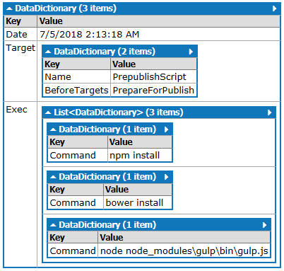
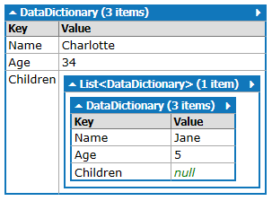

# DataDictionary

A dictionary wrapper that converts all complex values to Dictionary<string, object> or IEnumerable<Dictionary<string, object>> objects.

Furthermore object in <string, object> will always be one of the following:
  - a simple type (```string```, ```boolean```, ```int```, ```DateTime```, etc...) 
  - an array of type
    - DataDictionary 
    - simple type
  - DataDictionary

## Example

### Anonymous Object example

```csharp
var source = new {
    Date = DateTime.Now,
    Target = new {
        Name = "PrepublishScript",
        BeforeTargets = "PrepareForPublish"
    },
    Exec = new[] {
        new { Command = "npm install" },
        new { Command = "bower install" },
        new { Command = @"node node_modules\gulp\bin\gulp.js" }
    }
};
dd = DataDictionary.From(source);
```

Generates:



### Class example

```csharp
class Person
{
    public string Name { get; set; }
    public int Age { get; set; }
    public IEnumerable<Person> Children { get; set; }
}

void Main()
{

  var person = new Person()
  {
    Name = "Charlotte",
    Age = 34,
    Children = new [] {
      new Person { Name = "Jane" , Age = 5 }
    }
 };

  var dd = DataDictionary.From(person);
}
```

Generates:


